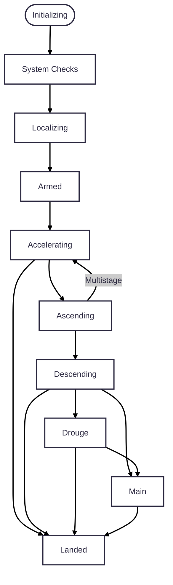

# Pioneer Rocketry Flight Computer V3

## Hardware

### Sensors/IC's
- Main MCU: STM32F446RE
- High G Accel: LSM6DSV320
- Magnetometer: MMC5603
- Barometer: MS560702BA03-50
- GPS: SAM-M8Q

### Other Hardware Features
- 3 Pyro Channels
- I2C, SPI Breakout
- 4 Servos
- Lora SX1262 Radio

## Software
- State Estimation for Attitude and Position
- Live Telemetery
- Staging Logic/Inflight Events
- Software will be written in c++
- Active Control

### State Machine/Flow
The software will be a (mostly) linear state machine.

The state machine can fo from Coasting up to Accelerating if its a multistage rocket. It can also skip states incase of any failures.

Also note that standard orientation solving doesn't work while the rocket is accelerating, where we will have to use intergration of angular velocity.

### Testing

#### Hardware-in-the-loop Testing (HILT)
HILT uses "fake" sensor readings to simulate a flight.
This is done by plugging it into a computer, and sending it data via USB/Serial, and having it pretend like its flying

#### Flight Tests
Flights are going to start out basic by just trying to quantify where the rocket is, and how fast. As well as testing state transitions. \
After every successful flight we can add more features like testing parachute deployment, then 2nd stage deployment ignition, then control. \
We also need to test it in high Speed and high G flights.
